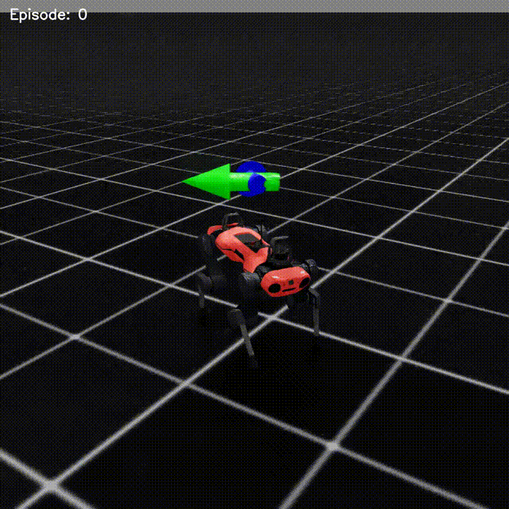
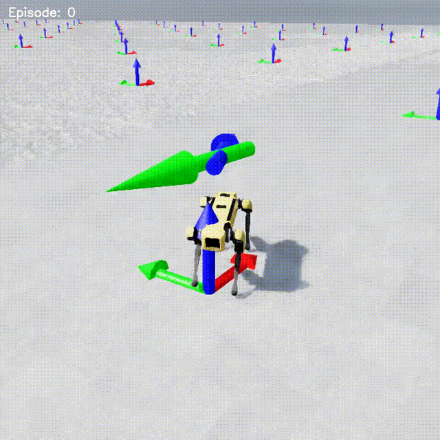
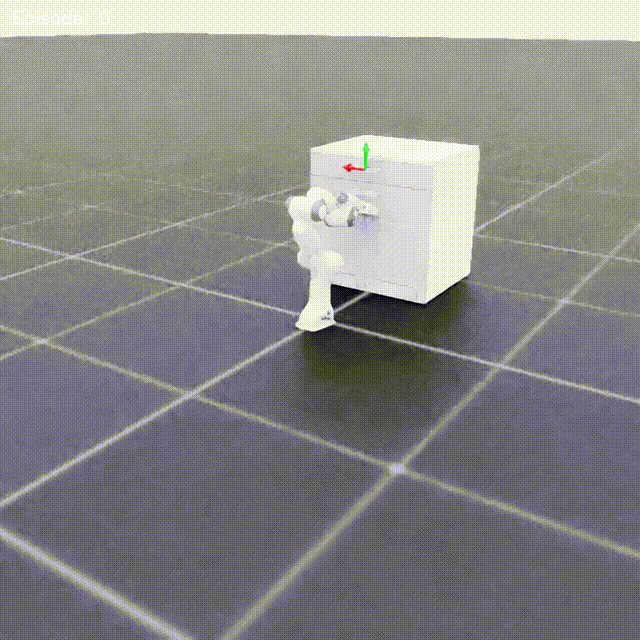
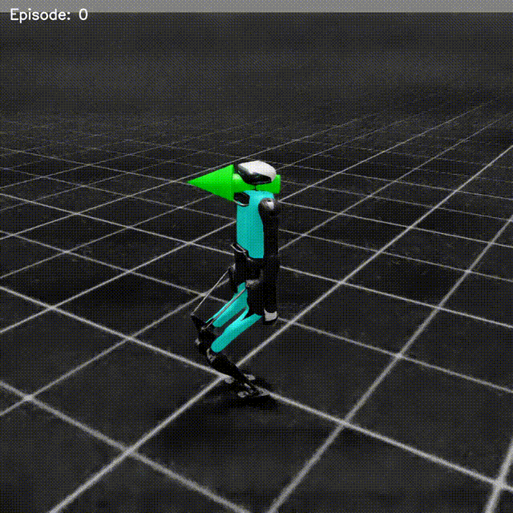
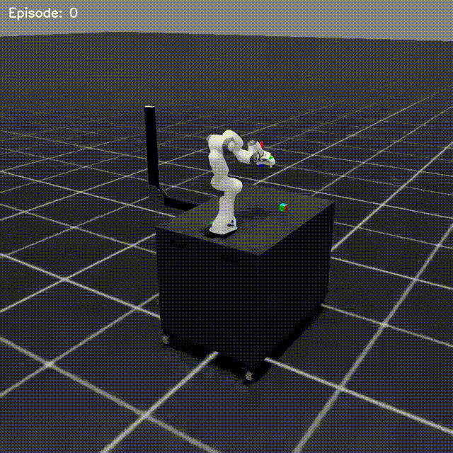

# PPO Implementation with IsaacLab

Proximal Policy Optimization (PPO) implementation in PyTorch for robotic control tasks with NVIDIA IsaacLab.

<table>
  <tr>
    <td></td>
    <td></td>
    <td></td>
  </tr>
  <tr>
    <td></td>
    <td></td>
    <td></td>
  </tr>
</table>

## Built and Tested On

- **OS:** Ubuntu 24.04
- **RAM:** 16GB
- **GPU:** RTX 4070 (8GB VRAM)

## Installation

1. Install [uv](https://docs.astral.sh/uv/):
   ```bash
   pip3 install uv
   ```

2. Clone and setup the project:
   ```bash
   git clone <repository-url>
   cd IsaacLab
   uv sync
   ```

   > Installation takes approximately 20 minutes.

## Usage

### Training
```bash
uv run scripts/MyPPO_Isaac.py --env "$ENV_NAME"
```

### Evaluation
```bash
uv run scripts/MyPPO_Isaac.py --env "$ENV_NAME" --mode test
```

**Note:** Training and inference run in headless mode with evaluation videos saved automatically.

